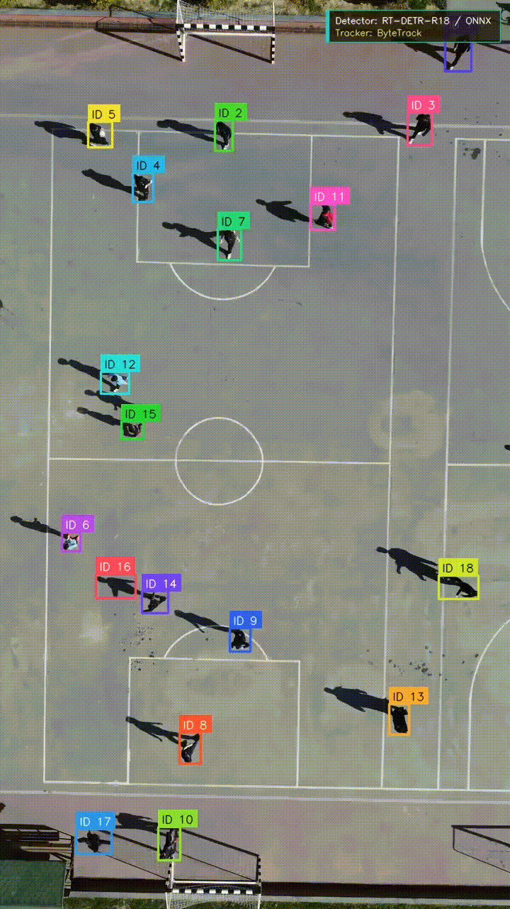
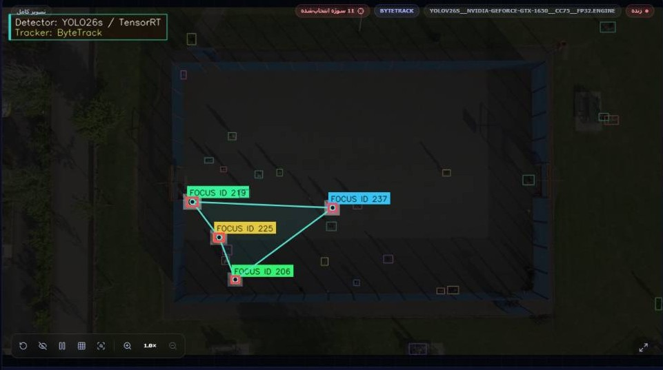

# Real-Time Aerial Human Detection, Tracking & Monitoring

<p align="center">

**A Deep Learning and Computer Vision Framework for Real-Time Aerial Human Detection, Multi-Object Tracking, Optimized Inference, and Desktop Deployment**

</p>

<p align="center">


</p>

<p align="center">


</p>

<p align="center">


</p>

<p align="center">


</p>
---
## 🎥 Real-Time Tracking Demo

| YOLO26s + ByteTrack | RT-DETR-R18 + ByteTrack |





---

## 📑 Table of Contents

- [Technology Stack](#-technology-stack)
- [Languages](#-languages)
- [Frontend](#-frontend)
- [Backend](#-backend)
- [Desktop Application](#-desktop-application)
- [AI and Computer Vision](#-ai-and-computer-vision)
- [Detection Models](#-detection-models)
- [Multi-Object Tracking](#-multi-object-tracking)
- [Inference and Acceleration](#-inference-and-acceleration)
- [Storage and Configuration](#-storage-and-configuration)
- [Build and Deployment](#-build-and-deployment)
- [System Architecture](#-system-architecture)
- [Research Pipeline](#-research-pipeline)
- [Overview](#-overview)
- [Key Contributions](#-key-contributions)
- [Dataset](#-dataset)
- [Training Protocol](#-training-protocol)
- [Detection Results](#-detection-results)
- [Inference Benchmark](#-inference-benchmark)
- [Memory and Artifact Analysis](#-memory-and-artifact-analysis)
- [Tracking Results](#-tracking-results)
- [ATPC](#-aerial-tiny-person-curriculum-atpc)
- [Pareto Analysis](#-pareto-analysis)
- [Final Configuration](#-final-configuration)
- [Project Structure](#-project-structure)
- [Reproducibility](#-reproducibility)
- [Limitations](#-limitations)
- [Future Work](#-future-work)
- [Scientific Roadmap](#-scientific-roadmap)
- [Citation](#-citation)
- [License](#-license)

---

# 🧩 Technology Stack

This project combines **deep learning, computer vision, object detection, multi-object tracking, optimized inference, local backend processing, and native desktop deployment**.

The technology stack is organized into the following layers:

```text
┌──────────────────────────────────────────────────────────────────┐
│                        DESKTOP APPLICATION                        │
│                                                                  │
│                Tauri + Rust + WebView2 + Windows                 │
└───────────────────────────────┬──────────────────────────────────┘
                                │
                                ▼
┌──────────────────────────────────────────────────────────────────┐
│                         FRONTEND / GUI                            │
│                                                                  │
│          React + TypeScript + Vite + Tailwind CSS                │
└───────────────────────────────┬──────────────────────────────────┘
                                │
                         HTTP / WebSocket
                                │
                                ▼
┌──────────────────────────────────────────────────────────────────┐
│                            BACKEND                               │
│                                                                  │
│                   Python + FastAPI + Uvicorn                     │
└───────────────────────────────┬──────────────────────────────────┘
                                │
                                ▼
┌──────────────────────────────────────────────────────────────────┐
│                     AI / COMPUTER VISION                         │
│                                                                  │
│             PyTorch + OpenCV + NumPy + Ultralytics               │
└───────────────────────────────┬──────────────────────────────────┘
                                │
                                ▼
┌──────────────────────────────────────────────────────────────────┐
│                        DETECTION                                 │
│                                                                  │
│              YOLO26s / RT-DETR-R18 / BPD-YOLOn                   │
└───────────────────────────────┬──────────────────────────────────┘
                                │
                                ▼
┌──────────────────────────────────────────────────────────────────┐
│                    INFERENCE & ACCELERATION                      │
│                                                                  │
│          PyTorch → ONNX → ONNX Runtime → TensorRT FP16          │
│                                                                  │
│                         CUDA / NVIDIA GPU                         │
└───────────────────────────────┬──────────────────────────────────┘
                                │
                                ▼
┌──────────────────────────────────────────────────────────────────┐
│                         TRACKING                                 │
│                                                                  │
│                    ByteTrack / BoT-SORT                          │
└───────────────────────────────┬──────────────────────────────────┘
                                │
                                ▼
┌──────────────────────────────────────────────────────────────────┐
│                    EVALUATION & STORAGE                          │
│                                                                  │
│      HOTA / MOTA / IDF1 / IDSW / FPS / Latency / VRAM / SQLite  │
└──────────────────────────────────────────────────────────────────┘
```

---

# 🗣️ Languages

| Language | Main Role |
|---|---|
| 🐍 **Python 3.12** | Deep learning, computer vision, backend, inference and experimentation |
| 🔷 **TypeScript** | Frontend application and GUI logic |
| 🦀 **Rust** | Native desktop application through Tauri |
| 🌐 **HTML** | Frontend document structure |
| 🎨 **CSS** | User-interface styling |
| 🗄️ **SQL** | SQLite database operations |
| 📦 **JSON** | Configuration and structured communication |
| ⚙️ **YAML** | Configuration and experiment definitions |
| 🦀 **TOML** | Rust/Tauri configuration |

---

# 🖥️ Frontend

The graphical user interface is implemented using a modern web technology stack.

### Core Technologies

```text
React
TypeScript
Vite
Tailwind CSS
HTML
CSS
```

### Frontend Responsibilities

The frontend provides:

- Real-time video visualization
- Detection visualization
- Bounding-box rendering
- Track-ID visualization
- Model selection
- Tracker selection
- Inference configuration
- Runtime status
- GPU status
- Hardware information
- Input/output management
- Result visualization
- Communication with the local backend

### Frontend Communication

```text
React / TypeScript
        │
        ├──────── HTTP ────────► FastAPI
        │
        └──── WebSocket ───────► FastAPI
```

---

# ⚙️ Backend

The backend is implemented using:

```text
Python 3.12
FastAPI
Uvicorn
```

### Backend Responsibilities

- Model loading
- Inference management
- Image processing
- Video processing
- Detection
- Tracking
- Runtime configuration
- Hardware detection
- GPU monitoring
- ONNX inference
- TensorRT inference
- Result generation
- API communication
- WebSocket communication

### Backend Architecture

```text
┌──────────────────────────┐
│       React GUI          │
└────────────┬─────────────┘
             │
       HTTP / WebSocket
             │
             ▼
┌──────────────────────────┐
│     FastAPI Backend      │
│       + Uvicorn          │
└────────────┬─────────────┘
             │
             ▼
┌──────────────────────────┐
│     AI / CV Pipeline     │
└──────────────────────────┘
```

---

# 🪟 Desktop Application

The desktop application is based on:

- **Tauri**
- **Rust**
- **WebView2**
- **Windows**

The desktop architecture is:

```text
React
  │
  ▼
Vite
  │
  ▼
Frontend Application
  │
  ▼
Tauri
  │
  ▼
Rust
  │
  ▼
WebView2
  │
  ▼
Windows Desktop
```

This architecture combines a modern web-based interface with a native desktop shell.

---

# 🤖 AI and Computer Vision

The AI/CV layer is based on:

| Technology | Purpose |
|---|---|
| **PyTorch** | Deep learning and model execution |
| **OpenCV** | Image/video processing |
| **NumPy** | Numerical computation |
| **Ultralytics** | YOLO model ecosystem and inference |
| **ONNX** | Portable model representation |
| **ONNX Runtime** | Optimized ONNX inference |
| **TensorRT** | NVIDIA GPU inference optimization |
| **CUDA** | GPU acceleration |

---

# 🎯 Detection Models

Three detector architectures were evaluated:

```text
┌─────────────────────────────┐
│          Detectors           │
├─────────────────────────────┤
│                             │
│  YOLO26s                    │
│                             │
│  RT-DETR-R18                │
│                             │
│  BPD-YOLOn/L-FPN            │
│                             │
└─────────────────────────────┘
```

### YOLO26s

Speed-oriented detector with the strongest real-time performance.

### RT-DETR-R18

Transformer-based detector with the highest detection accuracy in the evaluated experiments.

### BPD-YOLOn/L-FPN

Specialized small-object detection baseline included for comparative evaluation.

---

# 🎯 Multi-Object Tracking

Two tracking algorithms were evaluated:

```text
ByteTrack
BoT-SORT
```

The tracking pipeline is:

```text
Detection
    │
    ▼
Bounding Boxes
    │
    ▼
Multi-Object Tracker
    │
    ▼
Track IDs
    │
    ▼
Temporal Association
```

Tracking metrics include:

- HOTA
- MOTA
- IDF1
- IDSW
- IDSW / 100 frames
- DetA
- AssA
- MOTP
- Fragmentation

---

# ⚡ Inference and Acceleration

The project evaluates three inference backends:

```text
                ┌───────────────┐
                │    PyTorch    │
                └───────┬───────┘
                        │
                        ▼
                ┌───────────────┐
                │     ONNX      │
                └───────┬───────┘
                        │
                        ▼
                ┌───────────────┐
                │ ONNX Runtime  │
                └───────┬───────┘
                        │
                        ▼
                ┌───────────────┐
                │   TensorRT    │
                │     FP16      │
                └───────────────┘
```

### Reference Environment

| Component | Version |
|---|---:|
| Python | 3.12.13 |
| PyTorch | 2.13.0 |
| CUDA | 13.0 |
| ONNX | 1.21.0 |
| ONNX Runtime | 1.24.4 |
| TensorRT | 11.2.1.2 |
| Ultralytics | 8.4.116 |
| OpenCV | 5.0.0 |
| GPU | NVIDIA L4 |

---

# 🗃️ Storage and Configuration

The project uses:

```text
SQLite
JSON
YAML
TOML
```

### SQLite

Used for local structured persistent data.

### JSON

Used for structured configuration and communication data.

### YAML

Used for configuration and experiment definitions.

### TOML

Used primarily for Rust/Tauri project configuration.

---

# 🔨 Build and Deployment

The desktop application uses:

```text
Node.js
npm
Vite
Rust
Cargo
Tauri CLI
MSVC
NSIS
WebView2
```

### Build Pipeline

```text
Frontend Source
      │
      ▼
   Node.js
      │
      ▼
     npm
      │
      ▼
     Vite
      │
      ▼
Frontend Build
      │
      ▼
    Tauri
      │
      ▼
     Rust
      │
      ▼
    Cargo
      │
      ▼
    MSVC
      │
      ▼
     NSIS
      │
      ▼
Windows Installer
```

---

# 🏗️ System Architecture

The complete runtime architecture is:

```text
┌──────────────────────────────────────────────────────────────┐
│                         WINDOWS OS                            │
└──────────────────────────────┬───────────────────────────────┘
                               │
                               ▼
┌──────────────────────────────────────────────────────────────┐
│                     TAURI + RUST                              │
│                         WebView2                              │
└──────────────────────────────┬───────────────────────────────┘
                               │
                               ▼
┌──────────────────────────────────────────────────────────────┐
│                   REACT FRONTEND                              │
│           TypeScript + Vite + Tailwind CSS                   │
└──────────────────────────────┬───────────────────────────────┘
                               │
                         HTTP / WebSocket
                               │
                               ▼
┌──────────────────────────────────────────────────────────────┐
│                    FASTAPI BACKEND                            │
│                  Python + Uvicorn                             │
└──────────────────────────────┬───────────────────────────────┘
                               │
                               ▼
┌──────────────────────────────────────────────────────────────┐
│                  COMPUTER VISION                              │
│          OpenCV + NumPy + PyTorch + Ultralytics              │
└──────────────────────────────┬───────────────────────────────┘
                               │
                               ▼
┌──────────────────────────────────────────────────────────────┐
│                     DETECTION                                 │
│          YOLO26s / RT-DETR-R18 / BPD-YOLOn                    │
└──────────────────────────────┬───────────────────────────────┘
                               │
                               ▼
┌──────────────────────────────────────────────────────────────┐
│                  INFERENCE BACKEND                            │
│      PyTorch / ONNX Runtime / TensorRT FP16 / CUDA           │
└──────────────────────────────┬───────────────────────────────┘
                               │
                               ▼
┌──────────────────────────────────────────────────────────────┐
│                       TRACKING                                │
│                  ByteTrack / BoT-SORT                         │
└──────────────────────────────┬───────────────────────────────┘
                               │
                               ▼
┌──────────────────────────────────────────────────────────────┐
│                EVALUATION / MONITORING                        │
│      FPS / Latency / HOTA / MOTA / IDF1 / IDSW / VRAM         │
└──────────────────────────────────────────────────────────────┘
```

---

# 🔬 Research Pipeline

The scientific pipeline follows:

```text
Aerial Image / Video
        │
        ▼
Dataset Preparation
        │
        ▼
Annotation Processing
        │
        ▼
Class Normalization
        │
        ▼
Detector Training
        │
        ▼
Tiny-Person Analysis
        │
        ▼
Model Comparison
        │
        ▼
Inference Conversion
        │
        ▼
PyTorch / ONNX / TensorRT
        │
        ▼
Multi-Object Tracking
        │
        ▼
Tracking Evaluation
        │
        ▼
Accuracy / Speed / Memory Analysis
        │
        ▼
Pareto Analysis
        │
        ▼
Real-Time Pipeline
        │
        ▼
Backend Integration
        │
        ▼
GUI Integration
        │
        ▼
Desktop Deployment
```

---

# 📌 Overview

This repository presents a complete experimental and engineering framework for:

> **Real-Time Aerial Human Detection, Multi-Object Tracking, Optimized Inference, and Desktop Deployment.**

The project investigates the complete pipeline from aerial-image dataset preparation and deep-learning model training to optimized inference, tracking, performance evaluation, and desktop integration.

The evaluated detector architectures are:

- **YOLO26s**
- **RT-DETR-R18**
- **BPD-YOLOn/L-FPN**

The evaluated tracking algorithms are:

- **ByteTrack**
- **BoT-SORT**

The evaluated inference backends are:

- **PyTorch**
- **ONNX Runtime**
- **NVIDIA TensorRT FP16**

---

# 🧪 Key Contributions

## 1. Controlled Detector Comparison

Three detector architectures were evaluated under a common experimental protocol.

| Model | Primary Profile |
|---|---|
| YOLO26s | Real-time / speed-oriented |
| RT-DETR-R18 | Accuracy-oriented |
| BPD-YOLOn/L-FPN | Small-object baseline |

---

## 2. Cross-Backend Evaluation

Each detector was evaluated through:

```text
PyTorch
   ↓
ONNX
   ↓
TensorRT FP16
```

This enables comparison of:

- Accuracy
- FPS
- Latency
- P95 latency
- VRAM
- Model artifact size

---

## 3. Multi-Object Tracking Evaluation

The study evaluates:

```text
3 Detectors × 2 Trackers = 6 Configurations
```

using:

- HOTA
- MOTA
- IDF1
- IDSW
- IDSW / 100
- DetA
- AssA
- MOTP
- Fragmentation

---

## 4. Pareto-Based Analysis

The project evaluates the trade-off between:

```text
Accuracy ↔ Speed
```

and:

```text
Tracking Quality ↔ Identity Stability
```

---

## 5. Aerial Tiny-Person Curriculum

An additional training strategy, **Aerial Tiny-Person Curriculum (ATPC)**, was investigated to improve sensitivity to small aerial persons.

ATPC introduces:

```text
Official Training Images
        +
Derived Tiny-Context Tiles
        ↓
Expanded Training Distribution
```

without modifying the inference architecture.

---

# 🗂️ Dataset

The controlled detector experiments use the **person-only VisDrone2019-DET** configuration.

The original categories:

```text
pedestrian
people
```

were mapped into:

```text
person
```

### Dataset Configuration

| Parameter | Value |
|---|---:|
| Official training images | 6,471 |
| Validation images | 548 |
| Target class | person |
| Input resolution | 1280 × 1280 |

The independent final test set was excluded from intermediate training, conversion, calibration and benchmarking procedures.

---

# 🧠 Training Protocol

The evaluated detector architectures were trained under a controlled protocol.

| Model | Best Epoch | Best mAP50-95 | AP50 |
|---|---:|---:|---:|
| **YOLO26s** | 30 | 0.31060 | 0.67438 |
| **RT-DETR-R18** | 45 | **0.34854** | **0.70839** |
| **BPD-YOLOn/L-FPN** | 43 | 0.29366 | 0.65557 |

### Interpretation

RT-DETR-R18 achieved the highest raw detection accuracy.

YOLO26s provided the strongest real-time throughput and latency profile.

---

# 📊 Detection Results

Final TensorRT-FP16 results:

| Model | mAP50-95 | AP50 | Precision | Recall | AP Tiny |
|---|---:|---:|---:|---:|---:|
| **YOLO26s** | 0.312938 | 0.679592 | **0.7532** | 0.5872 | 0.194015 |
| **RT-DETR-R18** | **0.353666** | **0.726303** | 0.3520 | **0.8286** | **0.221301** |
| **BPD-YOLOn/L-FPN** | 0.294211 | 0.654936 | 0.7390 | 0.5673 | 0.188526 |

### Object-Size Performance

| Model | AP Tiny | AP Small | AP Medium | AP Large |
|---|---:|---:|---:|---:|
| YOLO26s | 0.194015 | 0.388334 | 0.472091 | 0.458569 |
| BPD-YOLOn/L-FPN | 0.188526 | 0.366153 | 0.434958 | 0.330066 |
| RT-DETR-R18 | **0.221301** | **0.423062** | **0.533897** | **0.745512** |

---

# ⚡ Inference Benchmark

All inference measurements were obtained on an **NVIDIA L4**.

## TensorRT FP16

| Model | FPS | Mean Latency | P95 Latency | Peak VRAM |
|---|---:|---:|---:|---:|
| **YOLO26s** | **72.944** | **13.709 ms** | 14.509 ms | 668 MiB |
| RT-DETR-R18 | 50.412 | 19.836 ms | 20.575 ms | 820 MiB |
| BPD-YOLOn/L-FPN | 70.240 | 14.237 ms | 17.524 ms | **594 MiB** |

### Speed Ranking

```text
1. YOLO26s             72.944 FPS
2. BPD-YOLOn/L-FPN     70.240 FPS
3. RT-DETR-R18         50.412 FPS
```

### Latency Ranking

```text
1. YOLO26s             13.709 ms
2. BPD-YOLOn/L-FPN     14.237 ms
3. RT-DETR-R18         19.836 ms
```

---

# ⏱️ Latency Decomposition

TensorRT-FP16 latency was decomposed into:

```text
Pre-processing
      +
Inference
      +
Post-processing
      =
End-to-End Latency
```

| Model | Pre | Inference | Post | Total |
|---|---:|---:|---:|---:|
| YOLO26s | 7.709 ms | 4.832 ms | 0.769 ms | **13.709 ms** |
| BPD-YOLOn/L-FPN | 7.667 ms | 5.390 ms | 0.768 ms | **14.237 ms** |
| RT-DETR-R18 | 13.919 ms | 5.548 ms | 0.353 ms | **19.836 ms** |

---

# 💾 Memory and Artifact Analysis

## Peak VRAM

| Model | PyTorch | ONNX | TensorRT |
|---|---:|---:|---:|
| YOLO26s | 512 MiB | 1,352 MiB | 668 MiB |
| RT-DETR-R18 | 782 MiB | 724 MiB | 820 MiB |
| BPD-YOLOn/L-FPN | 562 MiB | 922 MiB | **594 MiB** |

## Artifact Size

| Model | Checkpoint | ONNX | TensorRT |
|---|---:|---:|---:|
| YOLO26s | 19.43 MiB | 36.88 MiB | 256.53 MiB |
| RT-DETR-R18 | 307.19 MiB | 77.72 MiB | 63.81 MiB |
| BPD-YOLOn/L-FPN | 3.64 MiB | 11.11 MiB | 150.55 MiB |

---

# 🎯 Tracking Results

Tracking evaluation was performed on:

```text
5 video clips
×
300 frames
=
1,500 frames
```

## Complete Results

| Detector | Tracker | HOTA | MOTA | IDF1 | IDSW | IDSW/100 |
|---|---|---:|---:|---:|---:|---:|
| BPD-YOLOn/L-FPN | BoT-SORT | 0.37480 | 0.30541 | 0.50824 | 18 | 1.20 |
| BPD-YOLOn/L-FPN | ByteTrack | 0.36092 | 0.29320 | 0.47098 | 30 | 2.00 |
| RT-DETR-R18 | BoT-SORT | **0.46474** | 0.34265 | **0.61090** | 59 | 3.93 |
| RT-DETR-R18 | ByteTrack | 0.45780 | 0.34625 | 0.59828 | 82 | 5.47 |
| YOLO26s | BoT-SORT | 0.40225 | **0.34658** | 0.55767 | **12** | **0.80** |
| YOLO26s | ByteTrack | 0.39019 | 0.34457 | 0.53266 | 23 | 1.53 |

---

# 🔄 Tracker Comparison

BoT-SORT improved tracking quality relative to ByteTrack across all evaluated detectors.

### YOLO26s

```text
HOTA:  0.39019 → 0.40225
IDF1:  0.53266 → 0.55767
IDSW:  23 → 12
```

### RT-DETR-R18

```text
HOTA:  0.45780 → 0.46474
IDF1:  0.59828 → 0.61090
IDSW:  82 → 59
```

### BPD-YOLOn/L-FPN

```text
HOTA:  0.36092 → 0.37480
IDF1:  0.47098 → 0.50824
IDSW:  30 → 18
```

---

# 🧬 Aerial Tiny-Person Curriculum (ATPC)

ATPC was investigated as a training strategy for improving small aerial-person detection.

### Configuration

| Component | Value |
|---|---:|
| Base architecture | YOLO26s |
| Official training images | 6,471 |
| Derived tiny-context tiles | 2,800 |
| Total training images | 9,271 |
| Validation images | 548 |
| Input resolution | 1280 × 1280 |
| Batch size | 8 |
| Optimizer | AdamW |
| Seed | 42 |
| Baseline training budget | 35 epochs |
| Target class | person |

### Results

| Metric | Baseline | YOLO26s + ATPC |
|---|---:|---:|
| Best mAP50-95 | 0.31060 | **≈0.34058** |
| AP50 / mAP50 | 0.67438 | **≈0.727** |
| Precision | — | ≈0.765 |
| Recall | — | ≈0.650 |

The best observed mAP50-95 improvement was approximately:

```text
0.31060 → 0.34058

Absolute improvement:
+0.02998

Relative improvement:
≈ 9.65%
```

### Experimental Qualification

ATPC should be interpreted as a **training-recipe improvement** rather than a purely architectural contribution because it uses additional derived training samples.

```text
Baseline
6,471 images

ATPC
6,471 official images
+
2,800 derived tiles
=
9,271 training samples
```

---

# 📈 Pareto Analysis

The experiments reveal different optimization profiles.

### YOLO26s

**Real-time-oriented profile**

- Highest FPS
- Lowest mean latency
- High precision
- Strong tracking stability
- Lowest identity-switch rate with BoT-SORT

### RT-DETR-R18

**Accuracy-oriented profile**

- Highest mAP50-95
- Highest AP50
- Highest Recall
- Highest AP Tiny
- Highest HOTA
- Highest IDF1

### BPD-YOLOn/L-FPN

**Memory-oriented baseline**

- Lowest TensorRT VRAM
- High throughput
- Lower detection accuracy

---

# 🏆 Final Configuration

The final operational configuration is:

```text
┌───────────────────────────────┐
│          YOLO26s              │
│             +                 │
│       TensorRT FP16           │
│             +                 │
│         BoT-SORT              │
└───────────────────────────────┘
```

### Detection

```text
FPS          = 72.944
Mean Latency = 13.709 ms
mAP50-95     = 0.312938
Peak VRAM    = 668 MiB
```

### Tracking

```text
HOTA         = 0.40225
IDF1         = 0.55767
MOTA         = 0.34658
IDSW         = 12
IDSW / 100   = 0.80
```

---

# 🧭 Model Selection Rationale

The final model was not selected using detection accuracy alone.

The selection criteria were:

```text
Detection Accuracy
        +
Throughput
        +
Latency
        +
VRAM
        +
Tracking Quality
        +
Identity Stability
```

Therefore:

```text
Maximum Detection Accuracy
        ↓
RT-DETR-R18

Maximum Real-Time Throughput
        ↓
YOLO26s

Minimum TensorRT VRAM
        ↓
BPD-YOLOn/L-FPN

Best HOTA / IDF1
        ↓
RT-DETR-R18 + BoT-SORT

Best MOTA / Identity Stability
        ↓
YOLO26s + BoT-SORT
```

The resulting operational choice is:

> **YOLO26s + TensorRT FP16 + BoT-SORT**

---

# 📁 Project Structure

```text
real-time-aerial-human-detection-tracking/
│
├── README.md
├── LICENSE
├── CITATION.cff
├── requirements.txt
├── .gitignore
│
├── docs/
│   ├── methodology.md
│   ├── dataset.md
│   ├── detection.md
│   ├── tracking.md
│   ├── inference-optimization.md
│   ├── experiments.md
│   └── reproducibility.md
│
├── src/
│   ├── detection/
│   ├── tracking/
│   ├── inference/
│   ├── evaluation/
│   └── utils/
│
├── configs/
│   ├── detection/
│   ├── tracking/
│   └── inference/
│
├── scripts/
│
├── notebooks/
│
├── experiments/
│
├── results/
│   ├── detection/
│   ├── tracking/
│   ├── benchmarks/
│   └── figures/
│
├── assets/
│   ├── architecture/
│   ├── qualitative-results/
│   └── figures/
│
└── tests/
```

---

# 🔁 Reproducibility

The reported results are tied to the corresponding experimental protocol.

### Detection

```text
Dataset:
VisDrone2019-DET

Validation:
548 images

Input:
1280 × 1280
```

### Tracking

```text
5 clips
300 frames / clip
1,500 total frames
```

### Hardware

```text
NVIDIA L4
```

### Important

TensorRT engines are hardware-dependent.

Therefore:

> **TensorRT engines should be rebuilt for the target GPU before deployment.**

FPS, latency, VRAM and engine characteristics should then be re-evaluated.

---

# ⚠️ Limitations

## Hardware Dependency

The reported performance measurements were obtained on an NVIDIA L4 and should not be considered hardware-independent.

## Dataset Dependency

Detection results depend on the characteristics and object-size distribution of the evaluated aerial dataset.

## ATPC Experimental Design

ATPC uses additional derived training samples and therefore does not represent a strictly equal-budget architectural ablation.

## Tracking Evaluation Size

Tracking results were obtained from 1,500 frames across five video clips.

## TensorRT Portability

TensorRT engines depend on the target GPU and inference configuration.

---

# 🔮 Future Work

Potential future research directions include:

- Independent final-test evaluation after freezing all model decisions
- Additional aerial datasets
- Cross-dataset generalization
- More extensive tiny-person evaluation
- Larger-scale tracking benchmarks
- Additional detector architectures
- FP8 / INT8 optimization
- End-to-end pipeline optimization
- GPU-accelerated preprocessing
- Temporal modeling
- Improved tiny-object feature representation
- More systematic ATPC ablation
- Confidence-threshold sensitivity analysis
- Cross-hardware benchmarking
- End-to-end latency profiling
- Advanced trajectory analysis

---

# 🗺️ Scientific Roadmap

The complete project development roadmap is organized into **26 scientific and engineering phases**.

```text
┌─────────────────────────────────────────────────────────────┐
│ PHASE 01 — Problem Definition                              │
└─────────────────────────────┬───────────────────────────────┘
                              ▼
┌─────────────────────────────────────────────────────────────┐
│ PHASE 02 — Scientific Literature Review                    │
└─────────────────────────────┬───────────────────────────────┘
                              ▼
┌─────────────────────────────────────────────────────────────┐
│ PHASE 03 — Dataset Selection & Analysis                    │
└─────────────────────────────┬───────────────────────────────┘
                              ▼
┌─────────────────────────────────────────────────────────────┐
│ PHASE 04 — Dataset Preparation                             │
└─────────────────────────────┬───────────────────────────────┘
                              ▼
┌─────────────────────────────────────────────────────────────┐
│ PHASE 05 — Annotation Processing & Normalization            │
└─────────────────────────────┬───────────────────────────────┘
                              ▼
┌─────────────────────────────────────────────────────────────┐
│ PHASE 06 — Experimental Protocol Definition                 │
└─────────────────────────────┬───────────────────────────────┘
                              ▼
┌─────────────────────────────────────────────────────────────┐
│ PHASE 07 — Baseline Detector Training                       │
└─────────────────────────────┬───────────────────────────────┘
                              ▼
┌─────────────────────────────────────────────────────────────┐
│ PHASE 08 — Tiny-Person Analysis                             │
└─────────────────────────────┬───────────────────────────────┘
                              ▼
┌─────────────────────────────────────────────────────────────┐
│ PHASE 09 — Detector Comparison                              │
└─────────────────────────────┬───────────────────────────────┘
                              ▼
┌─────────────────────────────────────────────────────────────┐
│ PHASE 10 — Training Strategy Development                    │
└─────────────────────────────┬───────────────────────────────┘
                              ▼
┌─────────────────────────────────────────────────────────────┐
│ PHASE 11 — Model Conversion                                 │
└─────────────────────────────┬───────────────────────────────┘
                              ▼
┌─────────────────────────────────────────────────────────────┐
│ PHASE 12 — Inference Benchmarking                           │
└─────────────────────────────┬───────────────────────────────┘
                              ▼
┌─────────────────────────────────────────────────────────────┐
│ PHASE 13 — Multi-Object Tracking Integration                │
└─────────────────────────────┬───────────────────────────────┘
                              ▼
┌─────────────────────────────────────────────────────────────┐
│ PHASE 14 — Tracking Evaluation                              │
└─────────────────────────────┬───────────────────────────────┘
                              ▼
┌─────────────────────────────────────────────────────────────┐
│ PHASE 15 — Multi-Criteria Performance Analysis              │
└─────────────────────────────┬───────────────────────────────┘
                              ▼
┌─────────────────────────────────────────────────────────────┐
│ PHASE 16 — Pareto-Based Model Selection                     │
└─────────────────────────────┬───────────────────────────────┘
                              ▼
┌─────────────────────────────────────────────────────────────┐
│ PHASE 17 — Real-Time Pipeline Integration                   │
└─────────────────────────────┬───────────────────────────────┘
                              ▼
┌─────────────────────────────────────────────────────────────┐
│ PHASE 18 — Backend Development                              │
└─────────────────────────────┬───────────────────────────────┘
                              ▼
┌─────────────────────────────────────────────────────────────┐
│ PHASE 19 — Frontend / GUI Development                       │
└─────────────────────────────┬───────────────────────────────┘
                              ▼
┌─────────────────────────────────────────────────────────────┐
│ PHASE 20 — Tauri / Rust Desktop Integration                 │
└─────────────────────────────┬───────────────────────────────┘
                              ▼
┌─────────────────────────────────────────────────────────────┐
│ PHASE 21 — Local Storage & Configuration                    │
└─────────────────────────────┬───────────────────────────────┘
                              ▼
┌─────────────────────────────────────────────────────────────┐
│ PHASE 22 — Runtime & Hardware Detection                     │
└─────────────────────────────┬───────────────────────────────┘
                              ▼
┌─────────────────────────────────────────────────────────────┐
│ PHASE 23 — End-to-End System Testing                        │
└─────────────────────────────┬───────────────────────────────┘
                              ▼
┌─────────────────────────────────────────────────────────────┐
│ PHASE 24 — Performance Profiling                            │
└─────────────────────────────┬───────────────────────────────┘
                              ▼
┌─────────────────────────────────────────────────────────────┐
│ PHASE 25 — Deployment & Packaging                           │
└─────────────────────────────┬───────────────────────────────┘
                              ▼
┌─────────────────────────────────────────────────────────────┐
│ PHASE 26 — Reproducibility & Scientific Documentation       │
└─────────────────────────────┬───────────────────────────────┘
                              ▼
                    ┌─────────────────────┐
                    │ FINAL SCIENTIFIC    │
                    │ RELEASE             │
                    └─────────────────────┘
```

---

# 🔬 Roadmap — Scientific Details

## Phase 01 — Problem Definition

Define the computational problem:

```text
Aerial Human Detection
        +
Tiny-Person Detection
        +
Multi-Object Tracking
        +
Real-Time Inference
```

Define the optimization objectives:

- Detection accuracy
- Tiny-object sensitivity
- Throughput
- Latency
- Memory consumption
- Tracking quality
- Identity stability

---

## Phase 02 — Literature Review

Review the state of the art in:

- UAV object detection
- Aerial human detection
- Tiny-object detection
- Real-time object detection
- Transformer-based detection
- Multi-object tracking
- Model optimization
- TensorRT deployment
- Real-time video analytics

The goal is:

```text
Research Gap
     ↓
Scientific Hypothesis
     ↓
Experimental Design
```

---

## Phase 03 — Dataset Analysis

Analyze:

- Image resolution
- Object distribution
- Object-size distribution
- Class distribution
- Annotation quality
- Training/validation/test partitions

---

## Phase 04 — Dataset Preparation

```text
Raw Dataset
     ↓
Annotation Processing
     ↓
Class Filtering
     ↓
Class Normalization
     ↓
Dataset Validation
     ↓
Training / Validation
```

---

## Phase 05 — Tiny-Person Analysis

Study the distribution of:

```text
Tiny
Small
Medium
Large
```

objects to quantify the difficulty of aerial human detection.

---

## Phase 06 — Experimental Protocol

Define:

```text
Input Resolution
Batch Size
Training Budget
Confidence Threshold
IoU Threshold
NMS
Hardware
Inference Backend
Evaluation Metrics
```

before performing the main comparison.

---

## Phase 07 — Baseline Training

Train:

```text
YOLO26s
RT-DETR-R18
BPD-YOLOn/L-FPN
```

Record:

- Hyperparameters
- Training curves
- Validation performance
- Best checkpoint
- Computational requirements

---

## Phase 08 — Tiny-Person Improvement

Investigate training strategies targeting tiny aerial persons.

Current strategy:

```text
ATPC
 ↓
Derived Tiny-Context Samples
 ↓
Expanded Training Distribution
```

---

## Phase 09 — Detector Evaluation

Compare:

```text
mAP50-95
AP50
Precision
Recall
AP Tiny
AP Small
AP Medium
AP Large
```

---

## Phase 10 — Training Strategy Evaluation

Distinguish:

```text
Architecture Contribution
        vs.
Training-Recipe Contribution
```

This distinction is important for scientifically interpreting ATPC.

---

## Phase 11 — Model Conversion

```text
PyTorch
   ↓
ONNX
   ↓
TensorRT
```

Validate model consistency after each conversion stage.

---

## Phase 12 — Inference Benchmark

Measure:

```text
FPS
Mean Latency
P95 Latency
VRAM
Artifact Size
```

for each backend.

---

## Phase 13 — Tracking Integration

```text
Detector
   ↓
Bounding Boxes
   ↓
ByteTrack / BoT-SORT
   ↓
Track IDs
```

---

## Phase 14 — Tracking Evaluation

Measure:

```text
HOTA
MOTA
IDF1
IDSW
IDSW / 100
DetA
AssA
MOTP
Fragmentation
```

---

## Phase 15 — Multi-Criteria Analysis

Construct the multidimensional performance profile:

```text
                 Accuracy
                    ▲
                    │
                    │
Memory ◄────────────┼────────────► Speed
                    │
                    │
                    ▼
             Tracking Quality
```

---

## Phase 16 — Pareto Selection

Analyze:

```text
Accuracy ↔ Speed
Tracking Quality ↔ Identity Stability
```

The goal is to select a configuration based on multiple objectives.

---

## Phase 17 — Real-Time Pipeline

```text
Input
  ↓
Decode
  ↓
Pre-processing
  ↓
Detection
  ↓
Post-processing
  ↓
Tracking
  ↓
Visualization
  ↓
Output
```

---

## Phase 18 — Backend Development

Implement the local backend using:

```text
Python
+
FastAPI
+
Uvicorn
```

with HTTP and WebSocket interfaces.

---

## Phase 19 — Frontend Development

Develop the GUI using:

```text
React
+
TypeScript
+
Vite
+
Tailwind CSS
```

---

## Phase 20 — Desktop Integration

Integrate the frontend into the native desktop environment:

```text
React
 ↓
Tauri
 ↓
Rust
 ↓
WebView2
 ↓
Windows
```

---

## Phase 21 — Storage and Configuration

Integrate:

```text
SQLite
JSON
YAML
TOML
```

for local persistence and configuration.

---

## Phase 22 — Runtime and Hardware Detection

Monitor:

- CPU
- GPU
- CUDA
- Inference backend
- Model state
- Runtime state
- Memory utilization

---

## Phase 23 — End-to-End Testing

Test:

```text
GUI
 ↓
Backend
 ↓
Model
 ↓
Inference Engine
 ↓
Tracker
 ↓
Visualization
 ↓
Output
```

including:

- Image input
- Video input
- Model loading
- Tracker initialization
- Backend switching
- GPU inference
- CPU fallback
- Error handling
- Output generation

---

## Phase 24 — Performance Profiling

Separate the complete pipeline into:

```text
Pre-processing
      +
Inference
      +
Post-processing
      +
Tracking
      +
Rendering
      =
End-to-End Latency
```

---

## Phase 25 — Deployment and Packaging

```text
Node.js / npm
      ↓
Vite
      ↓
Tauri
      ↓
Rust / Cargo
      ↓
MSVC
      ↓
NSIS
      ↓
Windows Installer
```

---

## Phase 26 — Scientific Documentation

Document:

- Dataset
- Dataset split
- Model architectures
- Training configuration
- Hyperparameters
- Hardware
- Software versions
- Inference backend
- Tracking configuration
- Evaluation metrics
- Benchmark methodology
- Conversion procedure
- Runtime configuration
- Project structure
- Reproducibility procedures

---

# 🧠 End-to-End Scientific Workflow

```text
┌─────────────────────────────┐
│     Scientific Problem      │
└──────────────┬──────────────┘
               ▼
┌─────────────────────────────┐
│     Literature Review       │
└──────────────┬──────────────┘
               ▼
┌─────────────────────────────┐
│ Dataset & Data Analysis     │
└──────────────┬──────────────┘
               ▼
┌─────────────────────────────┐
│ Baseline Model Development  │
└──────────────┬──────────────┘
               ▼
┌─────────────────────────────┐
│ Tiny-Person Strategy        │
│          ATPC               │
└──────────────┬──────────────┘
               ▼
┌─────────────────────────────┐
│ Detector Evaluation         │
└──────────────┬──────────────┘
               ▼
┌─────────────────────────────┐
│ Model Conversion            │
│ PyTorch → ONNX → TRT        │
└──────────────┬──────────────┘
               ▼
┌─────────────────────────────┐
│ Inference Benchmarking      │
└──────────────┬──────────────┘
               ▼
┌─────────────────────────────┐
│ Multi-Object Tracking       │
└──────────────┬──────────────┘
               ▼
┌─────────────────────────────┐
│ Tracking Evaluation         │
└──────────────┬──────────────┘
               ▼
┌─────────────────────────────┐
│ Multi-Criteria Analysis     │
└──────────────┬──────────────┘
               ▼
┌─────────────────────────────┐
│ Pareto-Based Selection      │
└──────────────┬──────────────┘
               ▼
┌─────────────────────────────┐
│ Real-Time Pipeline          │
└──────────────┬──────────────┘
               ▼
┌─────────────────────────────┐
│ FastAPI Backend             │
└──────────────┬──────────────┘
               ▼
┌─────────────────────────────┐
│ React / TypeScript GUI      │
└──────────────┬──────────────┘
               ▼
┌─────────────────────────────┐
│ Tauri / Rust Desktop        │
└──────────────┬──────────────┘
               ▼
┌─────────────────────────────┐
│ Testing & Profiling         │
└──────────────┬──────────────┘
               ▼
┌─────────────────────────────┐
│ Deployment & Packaging      │
└──────────────┬──────────────┘
               ▼
┌─────────────────────────────┐
│ Reproducible Release        │
└─────────────────────────────┘
```

---

# 📚 Scientific Summary

The project establishes an end-to-end framework for aerial human detection and tracking, covering:

```text
Dataset
   ↓
Deep Learning
   ↓
Object Detection
   ↓
Tiny-Person Analysis
   ↓
Model Optimization
   ↓
ONNX / TensorRT
   ↓
Multi-Object Tracking
   ↓
Performance Evaluation
   ↓
Real-Time Pipeline
   ↓
Backend
   ↓
Frontend
   ↓
Desktop Application
   ↓
Deployment
```

The experimental results demonstrate a clear trade-off between **accuracy, real-time throughput, latency, memory consumption, and tracking stability**.

The final operational configuration is:

```text
YOLO26s
+
TensorRT FP16
+
BoT-SORT
```

while **RT-DETR-R18** remains the strongest configuration when the primary objective is maximum detection and tracking accuracy.

---

# 📖 Citation

If this repository, methodology, implementation, or experimental results are used in academic work, please cite the project according to the information provided in:

```text
CITATION.cff
```

---

# 📄 License

See [`LICENSE`](LICENSE) for licensing and redistribution terms.

---

<p align="center">

**Real-Time Aerial Human Detection, Tracking & Monitoring**

<br>

<sub>
Deep Learning · Computer Vision · Tiny-Person Detection · Object Detection ·
Multi-Object Tracking · TensorRT · Real-Time Inference · React · FastAPI · Tauri · Rust
</sub>

</p>
